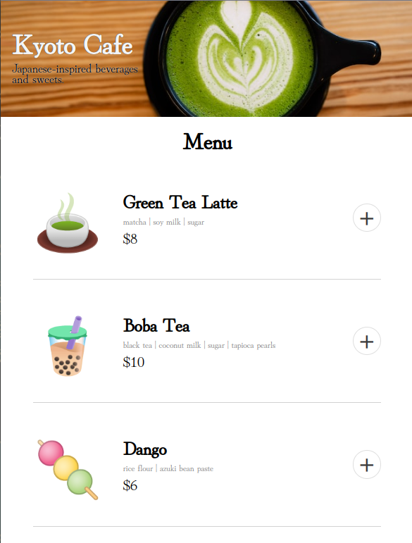

# Kyoto Cafe - Restaurant Ordering App

Kyoto Cafe is a mock-up ordering app that allows the user to add items from the menu to a cart, review the order and remove any items before continuing, and accepts payment info for processing.

## Project Purpose and Goals
This is a solo project from [Scrimba's](https://scrimba.com) Frontend Career Path program. The main goal was to put some essential JavaScript concepts to use, such as modules, array methods like `.map()` and `.reduce()`, and just overall functionality. 
The most challenging aspects of this project were trying to keep accessibility in the forefront (something I have been learning more about), and being future-oriented regarding adding functionality (basically, being kind to future me in the event this became a full stack app).  

## Project Status
There are few stretch goals that I may return to complete later:

- [ ] Add "meal deal" discounts
- [ ] Add user ratings

## Acknowledgments 
Thanks to [Scrimba](https://scrimba.com) for creating such a great program, and providing Figma files for these solo projects.

## Resources
Nothing too fancy was used for the UI or in the scripts, so I didn't have to do a ton of googling.  My main resource was (and usually always is) [MDN Web Docs](https://developer.mozilla.org/en-US/).